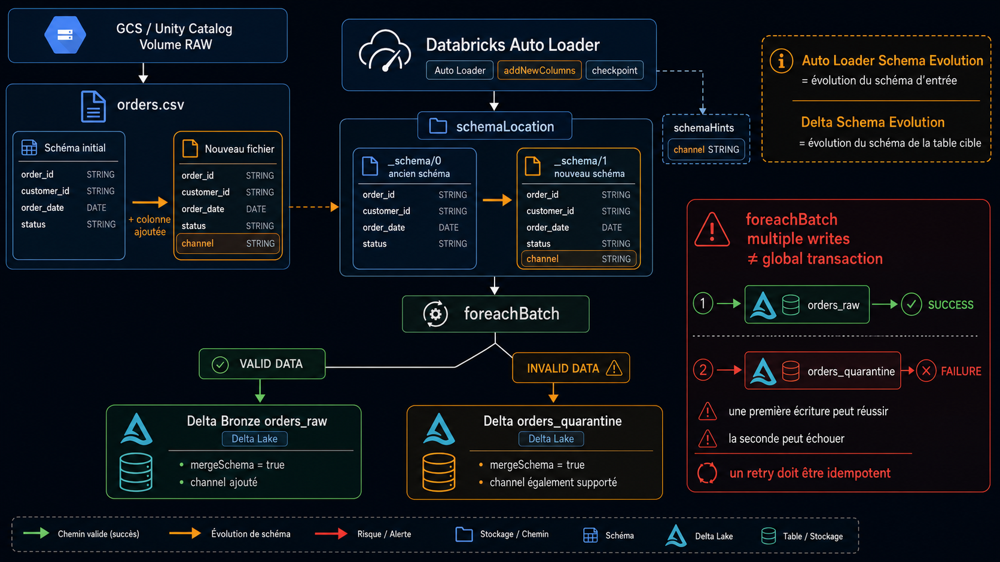
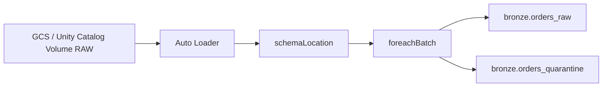

# Scenario 006 Auto Loader & Delta Schema Evolution



## Objectif

Comprendre et et securier l'arrivée d'une nouvelle colonne dans les fichiers RAW ingeres avec Databricks Auto Loader.

Le scénario distingue deux mécanismes différents :

1. l'évolution du schéma d'entrée gérée par Auto Loader ;
2. l'évolution du schéma des tables Delta cibles.

## Situation initiale

Schéma initial de `orders.csv` :

```text
order_id
customer_id
order_date
status
```

Un nouveau fichier arrive avec :

```text
order_id
customer_id
order_date
status
channel
```

Nouvelle colonne : `channel STRING`.

## Architecture



## Incident observé

Lors de l'arrivée de `channel`, Auto Loader a d'abord retourné :

`UNKNOWN_FIELD_EXCEPTION.NEW_FIELDS_IN_FILE`

Le nouveau schéma a ensuite été enregistré dans :

`/Volumes/dbx_lab_dev/landing/raw/_schemas/bronze_orders`

avec une nouvelle version contenant `channel STRING`.

## Correction Auto Loader

Le lecteur utilise :

```python
.option("cloudFiles.schemaEvolutionMode", "addNewColumns")
.option("cloudFiles.schemaHints", "channel STRING")
```

`schemaLocation` conserve les versions du schéma découvert.

`schemaHints` permet ici de préciser explicitement le type attendu de `channel`.

## Correction Delta Lake

Auto Loader peut connaître `channel` alors que les tables Delta cibles ne la connaissent pas encore.

Les écritures vers :

- `dbx_lab_dev.bronze.orders_raw`
- `dbx_lab_dev.bronze.orders_quarantine`

utilisent donc :

```python
.option("mergeSchema", "true")
```

Cela permet aux deux tables Delta d'accepter la nouvelle colonne.

## Piège foreachBatch

Le `foreachBatch` écrit dans plusieurs tables indépendantes.

Une situation possible est :

```text
orders_raw        -> commit OK
orders_quarantine -> erreur
micro-batch       -> FAILED
```

Les deux écritures ne constituent donc pas une transaction globale unique.

Un retry doit être conçu de manière idempotente.

## Idempotence des retries

Les écritures peuvent utiliser :

- `txnAppId`
- `txnVersion`

Le `batch_id` peut servir de version de transaction afin d'éviter qu'un même micro-batch soit appliqué plusieurs fois.

## Validation attendue

Après correction :

- Auto Loader reconnaît `channel` ;
- `orders_raw` contient `channel` ;
- `orders_quarantine` contient aussi `channel` ;
- le stream ne casse plus sur cette évolution de schéma ;
- les retries ne doivent pas créer de doublons.

## Points à retenir

- Auto Loader Schema Evolution et Delta Schema Evolution sont deux mécanismes différents.
- `schemaLocation` conserve les versions du schéma Auto Loader.
- `schemaHints` contrôle le type attendu d'une colonne connue.
- `mergeSchema=true` fait évoluer explicitement une table Delta.
- plusieurs écritures dans `foreachBatch` ne forment pas une transaction globale.
- les retries doivent être idempotents.

## Code

[Voir le code Bronze](../../src/ingestion/bronze_order.py)

[Reproduire le scénario](./reproduce.ps1)

[Valider le scénario](./validate.sql)
