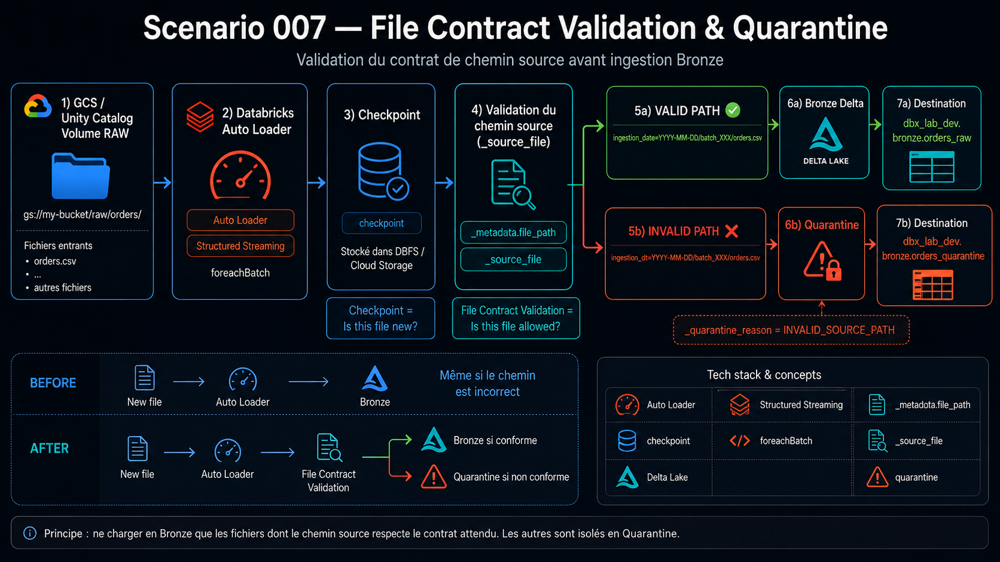
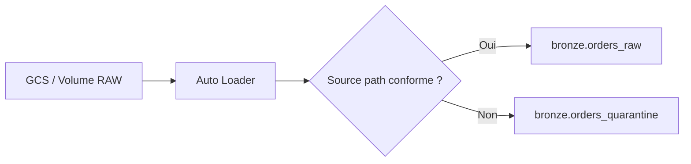

# Scenario 007 — File Contract Validation & Quarantine



## Objectif
Empêcher un fichier dont le chemin ne respecte pas le contrat de landing d'entrer dans la table Bronze principale.

## Architecture



## Contrat attendu

Les fichiers `orders` doivent respecter :

`ingestion_date=YYYY-MM-DD/batch_XXX/orders.csv`

Exemple valide :

`ecommerce/orders/ingestion_date=2026-08-23/batch_004/orders.csv`

Exemple invalide :

`ecommerce/orders/ingestion_dt=2026-08-23/batch_006/orders.csv`

## Incident reproduit

Un fichier dont le contenu CSV était valide a été placé dans un chemin incorrect :

`ingestion_dt=2026-08-23/batch_005/orders.csv`

Auto Loader a détecté ce fichier comme nouveau et l'a ingéré dans :

`dbx_lab_dev.bronze.orders_raw`

Le fichier était donc techniquement lisible, mais ne respectait pas notre contrat de landing.

## Cause racine

Auto Loader et son checkpoint répondent principalement à la question :

> Ce fichier est-il nouveau ?

Ils ne garantissent pas que le chemin du fichier respecte les conventions métier de la plateforme.

Notre pipeline ne contrôlait pas `_metadata.file_path` avant l'écriture Bronze.

## Correction

Le pipeline conserve maintenant le chemin d'origine :

`_source_file`

Puis `foreachBatch` sépare chaque micro-batch en deux flux.

### Fichier conforme

Exemple :

`ingestion_date=2026-08-23/batch_006/orders.csv`

Destination :

`dbx_lab_dev.bronze.orders_raw`

### Fichier non conforme

Exemple :

`ingestion_dt=2026-08-23/batch_006/orders.csv`

Destination :

`dbx_lab_dev.bronze.orders_quarantine`

Une colonne explique également le rejet :

`_quarantine_reason = INVALID_SOURCE_PATH`

## Validation

Après la correction, un nouveau fichier invalide a été déposé sous :

`ingestion_dt=2026-08-23/batch_006/orders.csv`

Résultat :

| Contrôle | Résultat |
|---|---|
| Présent dans `orders_raw` | Non ✅ |
| Présent dans `orders_quarantine` | Oui ✅ |
| `_source_file` conservé | Oui ✅ |
| `_quarantine_reason` renseigné | `INVALID_SOURCE_PATH` ✅ |

La correction empêche donc désormais un fichier hors contrat d'entrer dans la Bronze principale.

## Architecture finale

```text
GCS / Volume RAW
        |
        v
   Auto Loader
        |
        v
Checkpoint / File discovery
        |
        v
Validation _source_file
     /             \
    /               \
VALID               INVALID
  |                    |
  v                    v
orders_raw       orders_quarantine
                       |
                       v
             INVALID_SOURCE_PATH
```

## Point Tech Lead

Il faut distinguer deux responsabilités :

**File discovery**

Déterminer quels fichiers sont nouveaux grâce à Auto Loader et au checkpoint.

**File validation**

Déterminer quels fichiers sont autorisés à poursuivre dans la pipeline.

Un pipeline d'ingestion robuste peut contrôler notamment :

- chemin ;
- nom ;
- extension ;
- date de partition ;
- batch ;
- schéma ;
- qualité du contenu.

La quarantine permet de conserver les données rejetées avec suffisamment de contexte pour le diagnostic et un éventuel replay.

## Code

[Voir l'implémentation Bronze](../../src/ingestion/bronze_order.py)

[Voir le script permettant de reproduire l'incident](./reproduce.ps1)

## Résultat final

Avant :

`nouveau fichier → Auto Loader → Bronze`

Après :

`nouveau fichier → Auto Loader → validation du contrat → Bronze ou Quarantine`

Le pipeline protège maintenant la Bronze contre les fichiers dont le chemin ne respecte pas le contrat de landing.
