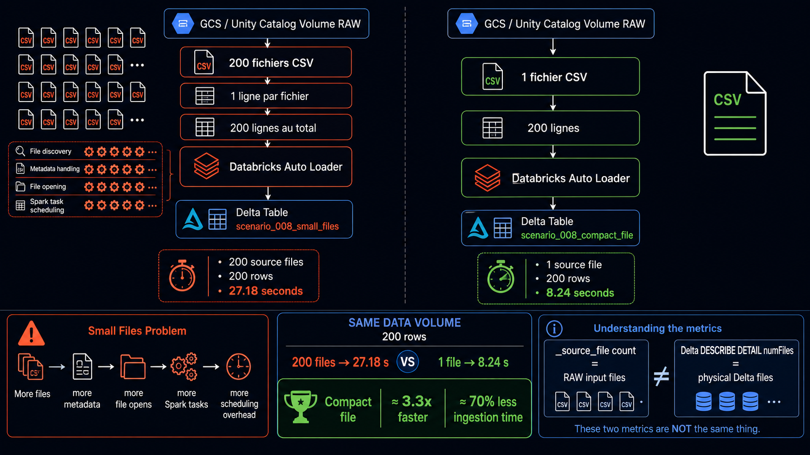
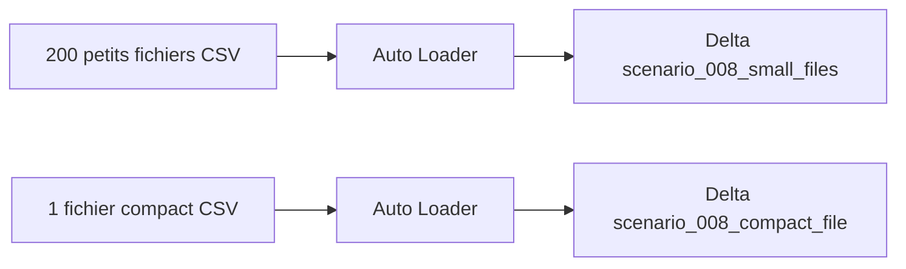

# Scenario 008 — Small Files vs Compact File



## Objectif

Mesurer l'impact du nombre de fichiers sur les performances d'ingestion Databricks Auto Loader, à volume métier identique.

Le test compare :

- 200 fichiers CSV contenant chacun 1 ligne ;
- 1 fichier CSV contenant 200 lignes.

## Architecture



## Test A — 200 petits fichiers

Configuration :

```text
200 fichiers
1 ligne par fichier
200 lignes au total
```

Résultat :

```text
ROWS=200
SOURCE_FILES=200
INGESTION_DURATION_SECONDS=27.18
```

## Test B — 1 fichier compact

Configuration :

```text
1 fichier
200 lignes par fichier
200 lignes au total
```

Résultat :

```text
ROWS=200
SOURCE_FILES=1
INGESTION_DURATION_SECONDS=8.24
```

## Comparaison

| Test | Fichiers source | Lignes | Durée |
|---|---:|---:|---:|
| Small files | 200 | 200 | 27,18 s |
| Compact file | 1 | 200 | 8,24 s |

Le fichier compact est environ **3,3 fois plus rapide** sur ce benchmark.

Gain observé :

```text
27,18 s - 8,24 s = 18,94 s
```

Soit environ **70 % de temps d'ingestion en moins**.

## Pourquoi les petits fichiers coûtent plus cher

Même avec le même nombre de lignes, chaque fichier ajoute du travail :

- découverte du fichier ;
- lecture des métadonnées ;
- ouverture du fichier ;
- création et planification des tâches Spark ;
- coordination supplémentaire côté moteur.

Le volume de données n'est donc pas le seul facteur de performance.

## Attention aux deux notions de fichiers

`COUNT(DISTINCT _source_file)` mesure le nombre de fichiers RAW ingérés.

`DESCRIBE DETAIL ... numFiles` mesure le nombre de fichiers physiques Delta composant la table.

Ces deux métriques peuvent avoir la même valeur par hasard, mais elles mesurent deux choses différentes.

## Isolation du benchmark

Le scénario utilise des ressources dédiées afin de ne pas modifier la pipeline principale :

```text
scenario_008_small_files
scenario_008_compact_file
```

avec des checkpoints et des tables Delta séparés.

## Points à retenir

- Même volume de données ne signifie pas même coût d'ingestion.
- Beaucoup de petits fichiers augmentent fortement l'overhead de traitement.
- Le problème small files peut apparaître côté RAW comme côté Delta.
- Les benchmarks doivent utiliser le même cluster et des conditions comparables.
- Pour de gros volumes, il faut privilégier des fichiers suffisamment volumineux plutôt qu'une multitude de fichiers minuscules.
- Sur ce test, 1 fichier compact est environ 3,3 fois plus rapide que 200 petits fichiers.

## Code

[Benchmark 200 petits fichiers](./ingest_small_files.py)

[Génération du fichier compact](./generate_compact_file.ps1)

[Benchmark fichier compact](./ingest_compact_file.py)
