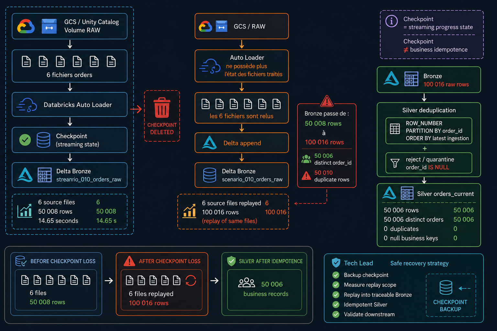
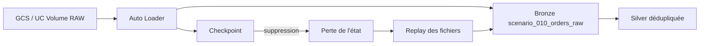

# Scenario 010 — Suppression du checkpoint Auto Loader



## Objectif

Simuler une perte du checkpoint Auto Loader afin d'observer le replay des fichiers RAW et le risque de doublons en Bronze.

Le scénario montre ensuite comment conserver une Bronze traçable tout en garantissant une Silver idempotente.

## Architecture



## Dataset de référence

Le test utilise exactement les 6 fichiers déjà présents dans la Bronze de référence.

Baseline avant perte du checkpoint :

```text
ROWS=50008
SOURCE_FILES=6
INGESTION_DURATION_SECONDS=14.65
```

La Bronze de référence contenait :

```text
total_rows      = 50008
distinct_orders = 50006
duplicate_rows  = 2
source_files    = 6
```

## Isolation du scénario

Le scénario utilise des ressources dédiées :

```text
RAW
/Volumes/dbx_lab_dev/landing/raw/scenarios/scenario_010/orders

CHECKPOINT
/Volumes/dbx_lab_dev/landing/raw/_checkpoints/scenario_010_orders

BRONZE
dbx_lab_dev.bronze.scenario_010_orders_raw

SILVER
dbx_lab_dev.silver.scenario_010_orders_current
```

La pipeline Bronze de production n'est pas utilisée pour la simulation destructive.

## Reproduction

1. Copier les 6 fichiers RAW de référence dans le dossier du scénario.
2. Exécuter Auto Loader avec un checkpoint dédié.
3. Vérifier la baseline.
4. Supprimer uniquement le checkpoint du scénario.
5. Relancer exactement le même stream sans vider la Bronze.

## Résultat après suppression du checkpoint

Après suppression du checkpoint puis redémarrage :

```text
ROWS=100016
SOURCE_FILES=6
INGESTION_DURATION_SECONDS=8.57
```

Le nombre de lignes a donc doublé :

```text
50008 -> 100016
```

Les 6 fichiers ont été relus car Auto Loader ne possédait plus son état de progression.

## Diagnostic des doublons

Après replay :

```text
total_rows      = 100016
distinct_orders = 50006
duplicate_rows  = 50010
```

Les 50 008 lignes du dataset ont été réinsérées.

Les 2 doublons déjà présents dans la baseline expliquent pourquoi le calcul global des lignes dupliquées vaut 50 010.

## Cause racine

Le checkpoint conserve l'état de progression du stream.

Quand il est supprimé, Auto Loader ne sait plus quels fichiers ont déjà été traités.

Avec une écriture Delta en mode append :

```text
checkpoint perdu
        ↓
fichiers considérés comme nouveaux
        ↓
relecture
        ↓
append
        ↓
doublons Bronze
```

Le checkpoint garantit donc la progression du stream, mais ne garantit pas à lui seul l'idempotence métier du sink.

## Correction aval — Silver idempotente

Une Silver dédiée a été reconstruite avec :

```sql
ROW_NUMBER() OVER (
    PARTITION BY order_id
    ORDER BY _ingestion_timestamp DESC, _source_file DESC
)
```

Les lignes avec `order_id IS NULL` sont exclues de `orders_current`.

Résultat final Silver :

```text
total_rows      = 50006
distinct_orders = 50006
duplicate_rows  = 0
null_order_ids  = 0
```

## Point important sur les clés NULL

Une première déduplication avait produit :

```text
total_rows      = 50007
distinct_orders = 50006
```

La cause était une ligne avec :

```text
order_id IS NULL
```

`COUNT(DISTINCT order_id)` ignore les valeurs NULL alors que `ROW_NUMBER() PARTITION BY order_id` conserve une partition NULL.

Une Silver métier doit donc traiter explicitement les clés invalides, par exemple via quarantine ou rejet.

## Validation du checkpoint reconstruit

Après le replay, Auto Loader recrée un nouveau checkpoint.

Un run supplémentaire avec ce checkpoint intact doit laisser la Bronze à :

```text
ROWS=100016
```

et ne doit pas produire :

```text
ROWS=150024
```

Cette vérification confirme que le nouvel état de progression est fonctionnel.

## Avant / Après

| Métrique | Baseline | Après perte checkpoint |
|---|---:|---:|
| Fichiers source | 6 | 6 |
| Lignes Bronze | 50 008 | 100 016 |
| Orders distincts | 50 006 | 50 006 |
| Lignes dupliquées | 2 | 50 010 |
| Durée Auto Loader | 14,65 s | 8,57 s |

Silver après sécurisation :

| Métrique | Valeur |
|---|---:|
| Lignes | 50 006 |
| Orders distincts | 50 006 |
| Doublons | 0 |
| Clés NULL | 0 |

## Point Tech Lead

Une perte de checkpoint doit être traitée comme un scénario de reprise contrôlée.

La stratégie recommandée est :

- conserver une Bronze traçable et rejouable ;
- accepter qu'un replay puisse réinjecter des données brutes ;
- rendre Silver idempotente via clé métier, séquencement et déduplication ;
- isoler les clés invalides ;
- mesurer le volume relu et l'impact avant de relancer une pipeline ;
- ne jamais supprimer un checkpoint de production sans sauvegarde et procédure de reprise.

## Fichiers

- `prepare_scenario_raw.ps1` : prépare le RAW isolé.
- `baseline_autoloader.py` : exécute Auto Loader et mesure le replay.
- `validate_scenario_010.sql` : contient les contrôles SQL du scénario.
