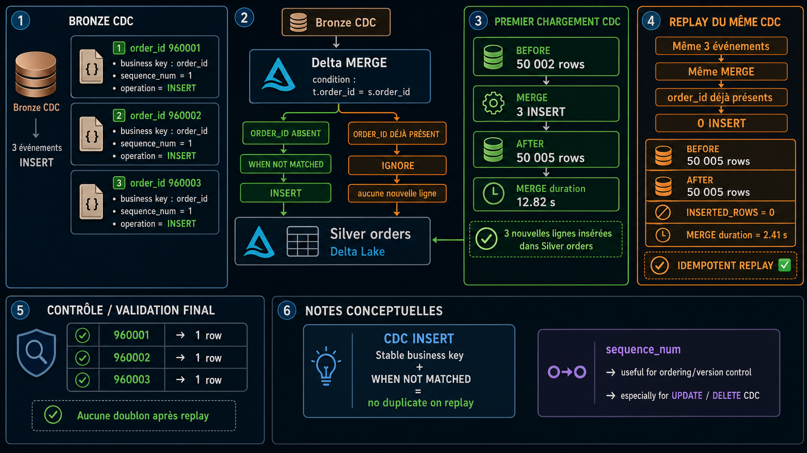
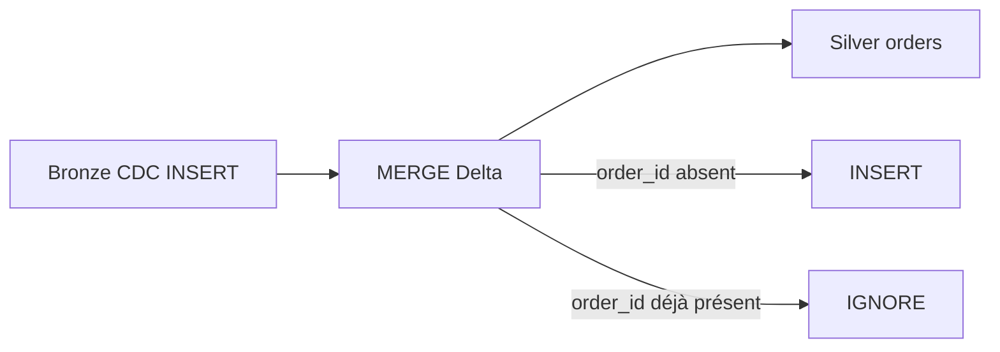

# Scenario 011 — Appliquer uniquement les nouveaux enregistrements



## Objectif

Simuler un flux CDC contenant uniquement des `INSERT` entre Bronze CDC et Silver orders.

Le scénario valide qu'un `MERGE WHEN NOT MATCHED` insère uniquement les nouvelles clés métier et qu'un replay du même CDC ne crée aucun doublon.

## Architecture



## Baseline Silver

Avant le scénario :

```text
total_rows       = 50002
distinct_orders  = 50002
latest_ingestion = 2026-08-23T14:40:35.250Z
```

## Dataset CDC

Le flux de test contient uniquement trois événements `INSERT` :

```text
960001 | 1001 | 2026-08-26 | paid    | sequence_num=1 | INSERT
960002 | 1002 | 2026-08-26 | pending | sequence_num=1 | INSERT
960003 | 1003 | 2026-08-26 | paid    | sequence_num=1 | INSERT
```

Source :

```text
dbx_lab_dev.bronze.scenario_011_orders_cdc
```

Cible isolée :

```text
dbx_lab_dev.silver.scenario_011_orders_current
```

La cible est un `SHALLOW CLONE` de `dbx_lab_dev.silver.orders_current`.

## Principe du MERGE

Le script applique uniquement :

```python
.whenNotMatchedInsert(...)
```

Condition de jointure :

```text
t.order_id = s.order_id
```

Donc :

```text
order_id absent   -> INSERT
order_id existant -> aucune nouvelle ligne
```

## Premier passage

Résultat :

```text
ROWS_BEFORE=50002
ROWS_AFTER=50005
INSERTED_ROWS=3
MERGE_DURATION_SECONDS=12.82
```

Les trois nouvelles commandes sont insérées.

## Deuxième passage — test d'idempotence

Le même CDC est rejoué sans modification.

Résultat :

```text
ROWS_BEFORE=50005
ROWS_AFTER=50005
INSERTED_ROWS=0
MERGE_DURATION_SECONDS=2.41
```

Aucune ligne supplémentaire n'est créée.

## Validation métier

Contrôle final sur les trois clés :

```text
960001 -> 1 ligne
960002 -> 1 ligne
960003 -> 1 ligne
```

Le replay du même événement CDC ne crée donc aucun doublon.

## Avant / Après

| Métrique | Premier run | Replay |
|---|---:|---:|
| Rows before | 50 002 | 50 005 |
| Rows after | 50 005 | 50 005 |
| Rows inserted | 3 | 0 |
| MERGE duration | 12,82 s | 2,41 s |

## Point Tech Lead

Pour un flux CDC INSERT :

- la clé métier doit être stable et correctement définie ;
- `WHEN NOT MATCHED` protège contre le replay d'une clé déjà présente ;
- `sequence_num` ou une version source reste utile pour les scénarios CDC plus complexes ;
- l'idempotence doit être validée par un deuxième run identique ;
- un test isolé évite tout impact sur la vraie Silver ;
- les performances du `MERGE` doivent être surveillées lorsque la cible devient volumineuse.

## Fichiers

- `apply_new_records_only.py` : applique le CDC INSERT avec Delta MERGE.
- `scenario_011_checks.sql` : prépare et valide le scénario.
