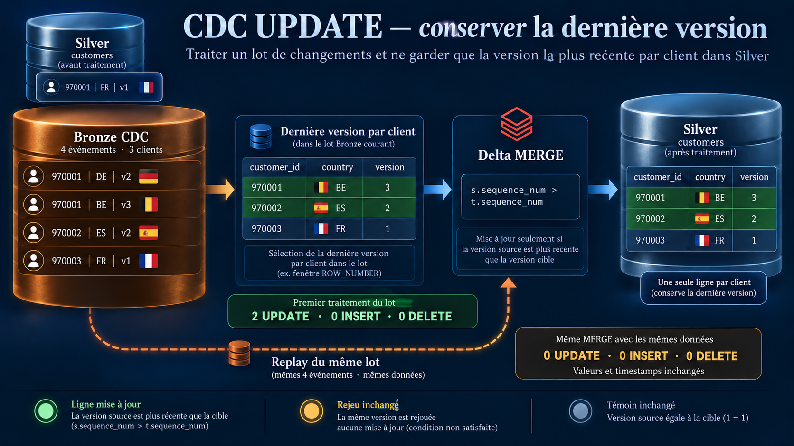
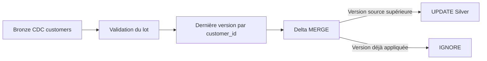

# Scenario 012 — Propagation d'une mise à jour



## Objectif

Propager les modifications de clients depuis Bronze CDC vers une table Silver Delta.

Le scénario vérifie que Silver conserve la dernière version de chaque client, avec une seule ligne par clé, et qu'un replay ne modifie plus les valeurs ni les timestamps.

## Architecture



## Baseline Silver

Trois clients fictifs sont préparés dans une table dédiée.

| customer_id | country | sequence_num |
|---|---|---:|
| 970001 | FR | 1 |
| 970002 | IT | 1 |
| 970003 | FR | 1 |

```text
total_rows         = 3
distinct_customers = 3
```

La colonne `_applied_at` est initialisée à `2026-01-01 08:00:00`.
Le client `970003` sert de témoin : son état complet doit rester inchangé.

## Dataset CDC

| customer_id | country | sequence_num | operation |
|---|---|---:|---|
| 970001 | DE | 2 | UPDATE |
| 970001 | BE | 3 | UPDATE |
| 970002 | ES | 2 | UPDATE |
| 970003 | FR | 1 | UPDATE |

Le même lot contient deux versions du client `970001`. La version 3 doit être retenue pour son état courant.

Source : `dbx_lab_dev.bronze.scenario_012_customers_cdc`.

Cible : `dbx_lab_dev.silver.scenario_012_customers_current`.

Les tables sont réservées à cet exercice. Le job et les tables de la pipeline ecommerce restent inchangés.

## Incident reproduit

La logique INSERT du scénario 011 est appliquée aux clients existants :

```python
.whenNotMatchedInsert(...)
```

Le MERGE termine sans erreur et conserve trois lignes. Aucun changement de pays n'est appliqué : le client `970001` reste en FR et le client `970002` reste en IT.

```text
UPDATED_ROWS  = 0
INSERTED_ROWS = 0
DELETED_ROWS  = 0
```

Le nombre de lignes est correct, mais deux valeurs métier sont anciennes.

## Cause racine

`WHEN NOT MATCHED` traite uniquement une clé absente de la cible.
Une clé déjà présente nécessite une action UPDATE.

Le lot doit aussi être préparé avant le MERGE : la clé identifie le client, alors que `sequence_num` détermine son état le plus récent.

## Correction

### Sélectionner la dernière version dans le lot

```python
latest_version = Window.partitionBy("customer_id").orderBy(F.desc("sequence_num"))
```

`row_number()` classe les versions de chaque client. Seule la ligne de rang 1 est conservée.

Le lot passe de quatre événements à trois lignes pour le MERGE.
Pour `970001`, la version 2 en DE est remplacée par la version 3 en BE dans la source préparée.

Avant cette sélection, les doublons identiques sont dédupliqués. Deux pays différents pour une même clé et version provoquent un rejet du lot, plutôt qu'un choix arbitraire.

### Appliquer uniquement une version supérieure à celle de Silver

```python
.whenMatchedUpdate(
    condition="s.sequence_num > t.sequence_num",
    set={
        "country": "s.country",
        "sequence_num": "s.sequence_num",
        "_applied_at": "current_timestamp()",
    }
)
```

Le premier passage applique `3 > 1` pour `970001` et `2 > 1` pour `970002`.
Le témoin reste inchangé : `1 > 1` est faux.

## Premier passage

Exécution validée sur Databricks serverless le 6 octobre 2026.

```text
ROWS_AFTER             = 3
UPDATED_ROWS           = 2
INSERTED_ROWS          = 0
DELETED_ROWS           = 0
MERGE_DURATION_SECONDS = 9.206
```

| customer_id | country | sequence_num |
|---|---|---:|
| 970001 | BE | 3 |
| 970002 | ES | 2 |
| 970003 | FR | 1 |

Les deux clients modifiés reçoivent un nouveau timestamp `_applied_at`.
Le client témoin conserve son timestamp initial.

## Deuxième passage — test d'idempotence

Le même lot est rejoué sans réinitialiser Silver entre les deux MERGE UPDATE.

```text
ROWS_AFTER             = 3
UPDATED_ROWS           = 0
INSERTED_ROWS          = 0
DELETED_ROWS           = 0
MERGE_DURATION_SECONDS = 4.804
```

Les versions source sont déjà appliquées : `3 > 3` et `2 > 2` sont faux.
La comparaison complète de Silver avant et après le replay confirme que les valeurs, les versions et les timestamps sont identiques.

## Avant / Après

| Contrôle | INSERT seul | UPDATE corrigé | Replay |
|---|---:|---:|---:|
| Lignes Silver | 3 | 3 | 3 |
| Clients distincts | 3 | 3 | 3 |
| Lignes mises à jour | 0 | 2 | 0 |
| Client 970001 | FR v1 | BE v3 | BE v3 |
| Client 970002 | IT v1 | ES v2 | ES v2 |
| Client témoin | FR v1 | FR v1 | FR v1 |
| Durée du MERGE | 4,628 s | 9,206 s | 4,804 s |

Les compteurs viennent des métriques Delta. Les assertions vérifient aussi les valeurs attendues, l'unicité des clés, les timestamps et l'état du témoin.

Ces durées concernent l'appel MERGE sur trois clients, hors préparation des tables et contrôles. Elles ne constituent pas un benchmark à grand volume.

## Point Tech Lead

- Le nombre de lignes et le succès du job ne suffisent pas à valider une mise à jour métier.
- La sélection de la dernière version dans le lot et la comparaison avec la version cible sont deux contrôles différents.
- L'ordre physique des lignes et le timestamp d'arrivée ne remplacent pas une version source fiable.
- L'idempotence se vérifie en rejouant le lot sans remise à zéro de la cible.
- Ce cas traite l'état courant, sans conserver toutes les versions intermédiaires comme une SCD Type 2.

Les rejets de données invalides, de versions ambiguës et de clients absents sont présents dans le code, mais ce run couvre le lot valide. DELETE, lots mixtes et arrivée tardive d'une ancienne version relèvent des scénarios suivants.

## Exécution

Depuis la racine du dépôt, avec le profil Databricks DEV connecté :

```powershell
.\scenarios\scenario_012_propagation_d_une_mise_a_jour\generate_update_cdc.ps1 -Profile DEV
```

Le script crée un notebook et lance le scénario complet. Chaque nouvelle exécution prépare à nouveau les deux tables de test ; le replay vérifié se déroule à l'intérieur du même run, après la correction.

## Fichiers

- [apply_update_cdc.py](./apply_update_cdc.py) : préparation, reproduction, correction et replay.
- [generate_update_cdc.ps1](./generate_update_cdc.ps1) : exécution Databricks et récupération des résultats.
- [validate_update_propagation.sql](./validate_update_propagation.sql) : contrôles SQL et historique Delta.
- [execution_update.json](./execution_update.json) : métriques, états Silver et empreinte du code exécuté.
- [Run Databricks](https://8259550801519022.2.gcp.databricks.com/?o=8259550801519022#job/268606099825147/run/454760512702283) : exécution utilisée pour les résultats ci-dessus.
