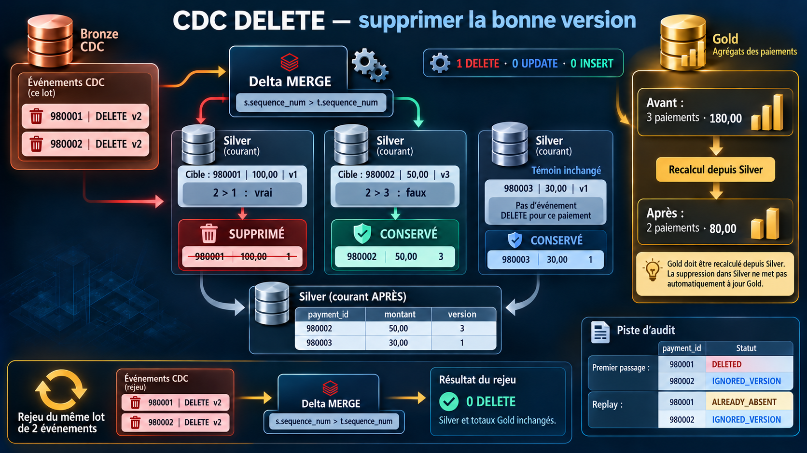
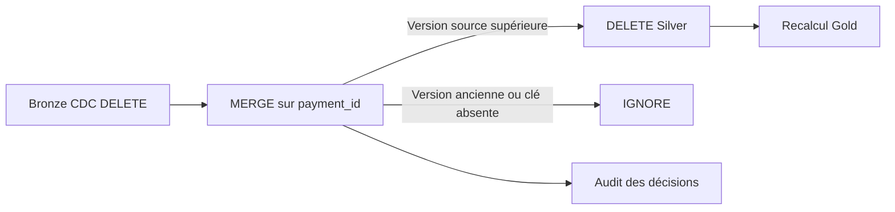

# Scenario 013 — Propagation d'une suppression



## Objectif

Appliquer un événement DELETE sur un paiement existant, recalculer Gold et conserver une trace du traitement.

Le scénario vérifie qu'une suppression ancienne ne peut pas effacer une version plus récente et que le replay conserve le même état métier.

## Architecture



## Baseline Silver

Trois paiements fictifs sont préparés dans une table dédiée.
Ils ont la même date de paiement et le statut `accepted`.

| payment_id | amount | sequence_num |
|---|---:|---:|
| 980001 | 100,00 | 1 |
| 980002 | 50,00 | 3 |
| 980003 | 30,00 | 1 |

```text
Silver : 3 paiements, 3 clés distinctes
Gold   : 3 paiements, montant total 180,00
```

Le paiement `980003` sert de témoin. Aucun événement ne le concerne.

## Dataset CDC

| event_id | payment_id | sequence_num | operation |
|---|---|---:|---|
| delete_001 | 980001 | 2 | DELETE |
| delete_002 | 980002 | 2 | DELETE |

Pour `980001`, la suppression v2 est plus récente que la cible v1.
Pour `980002`, elle est plus ancienne que la cible v3 : le paiement doit rester présent.

| Couche | Table |
|---|---|
| Bronze CDC | `dbx_lab_dev.bronze.scenario_013_payments_cdc` |
| Silver | `dbx_lab_dev.silver.scenario_013_payments_current` |
| Gold | `dbx_lab_dev.gold.scenario_013_payments_daily` |
| Audit | `dbx_lab_dev.bronze.scenario_013_delete_audit` |

Ces quatre tables sont réservées à l'exercice.

## Incident reproduit

Le MERGE supprime les clés correspondantes uniquement selon le type d'opération :

```python
.whenMatchedDelete(condition="s.operation = 'DELETE'")
```

Résultat :

```text
DELETED_ROWS       = 2
SILVER_ROWS_AFTER  = 1
GOLD_PAYMENT_TOTAL = 30,00
```

Le paiement `980002` disparaît alors que sa version 3 est plus récente que le DELETE v2 reçu.
Il ne reste que le témoin de `30,00`.

## Cause racine

`operation = 'DELETE'` indique une intention de suppression, mais ne dit pas si l'événement est encore applicable.

La comparaison des versions manque. Le traitement efface donc un état récent avec un événement ancien.

## Correction

La même baseline est restaurée dans les tables de test avant de mesurer la correction.

```python
.whenMatchedDelete(
    condition="s.operation = 'DELETE' AND s.sequence_num > t.sequence_num"
)
```

```text
980001 : 2 > 1       → DELETE
980002 : 2 > 3 faux  → IGNORE
980003 : aucun CDC   → inchangé
```

Le lot attend un seul événement DELETE par paiement. Les clés, versions et identifiants d'événement sont contrôlés avant le MERGE.

Le choix retenu est une suppression physique de la ligne dans la Silver courante. L'événement source reste dans Bronze CDC et chaque passage est tracé dans l'audit.

## Premier passage

Exécution validée sur Databricks serverless le 6 octobre 2026.

```text
DELETED_ROWS           = 1
UPDATED_ROWS           = 0
INSERTED_ROWS          = 0
SILVER_ROWS_AFTER      = 2
MERGE_DURATION_SECONDS = 4.684
```

| payment_id restant | amount | sequence_num |
|---|---:|---:|
| 980002 | 50,00 | 3 |
| 980003 | 30,00 | 1 |

Les deux lignes restantes sont identiques à leur état initial, y compris `_applied_at`.

## Validation Gold

Gold est reconstruite depuis les paiements restants dans Silver.

| Contrôle | Avant | DELETE sans garde | Après correction |
|---|---:|---:|---:|
| Nombre de paiements | 3 | 1 | 2 |
| Montant total | 180,00 | 30,00 | 80,00 |

La différence correcte est `100,00`, le montant du paiement supprimé.
Le MERGE Silver ne recalcule pas automatiquement une autre table : l'agrégation Gold est une étape distincte.

## Deuxième passage — test d'idempotence

Le même lot est rejoué sans réinitialiser Silver entre la correction et le replay.

```text
DELETED_ROWS           = 0
UPDATED_ROWS           = 0
INSERTED_ROWS          = 0
SILVER_ROWS_AFTER      = 2
GOLD_PAYMENT_TOTAL     = 80,00
MERGE_DURATION_SECONDS = 3.965
```

Le paiement `980001` est absent : aucune ligne ne correspond au DELETE.
Le paiement `980002` est toujours en version 3 : le DELETE v2 reste ignoré.

Les snapshots Silver et les agrégats Gold restent identiques.

## Audit

L'audit conserve une ligne par événement et par passage.

| Passage | event_id | Décision |
|---|---|---|
| Premier passage | delete_001 | DELETED |
| Premier passage | delete_002 | IGNORED_VERSION |
| Replay | delete_001 | ALREADY_ABSENT |
| Replay | delete_002 | IGNORED_VERSION |

L'audit passe de deux à quatre lignes au replay. Il journalise les tentatives ; l'idempotence vérifiée concerne l'état métier Silver et les agrégats Gold.

## Avant / Après

| Métrique | Sans comparaison de version | DELETE corrigé | Replay |
|---|---:|---:|---:|
| Lignes supprimées | 2 | 1 | 0 |
| Lignes Silver restantes | 1 | 2 | 2 |
| Montant Gold | 30,00 | 80,00 | 80,00 |
| Durée du MERGE | 8,820 s | 4,684 s | 3,965 s |

Les compteurs viennent des métriques Delta. Les assertions vérifient les clés restantes, les versions, les montants, les timestamps, les décisions d'audit et le replay.

Les durées concernent l'appel MERGE sur trois paiements, hors audit et recalcul Gold. Ce jeu valide le comportement, pas les performances à grand volume.

## Point à retenir

- Un DELETE doit être comparé à la version courante avant de supprimer une ligne.
- Une clé absente au replay ne doit pas être réinsérée par le traitement DELETE.
- Le résultat aval se vérifie aussi dans Gold : ici, deux paiements pour `80,00`.
- Un journal de tentatives peut évoluer alors que l'état métier reste idempotent.
- Une suppression physique retire aussi la version de Silver. Un futur INSERT ancien pourrait recréer la clé si le flux mixte ne conserve aucune mémoire de suppression.

L'audit trace le DELETE, mais ce MERGE ne l'utilise pas pour bloquer des INSERT futurs. Ce cas reste à traiter avec le CDC mixte.

Silver, l'audit et Gold sont écrits séparément. Le run couvre le chemin nominal et le replay ; il ne simule pas un échec entre ces étapes ni les lots invalides rejetés par les contrôles.

## Exécution

Depuis la racine du dépôt, avec le profil DEV connecté :

```powershell
.\scenarios\scenario_013_propagation_d_une_suppression\generate_delete_cdc.ps1 -Profile DEV
```

Chaque exécution prépare de nouveau les quatre tables du scénario. La remise à zéro après reproduction restaure la baseline pour la correction ; aucun reset n'intervient entre cette correction et son replay.

## Fichiers

- [apply_delete_cdc.py](./apply_delete_cdc.py) : reproduction, correction, audit, recalcul Gold et replay.
- [generate_delete_cdc.ps1](./generate_delete_cdc.ps1) : exécution Databricks et récupération des résultats.
- [validate_delete_propagation.sql](./validate_delete_propagation.sql) : contrôles Silver, Gold, audit et historique Delta.
- [execution_delete.json](./execution_delete.json) : états avant/après, métriques et empreinte du code exécuté.
- [Run Databricks](https://8259550801519022.2.gcp.databricks.com/?o=8259550801519022#job/1101036191636198/run/424630296570875) : exécution utilisée pour les résultats ci-dessus.
- [MERGE Delta](https://docs.databricks.com/gcp/en/delta/merge) : comportement des clauses et conditions.
