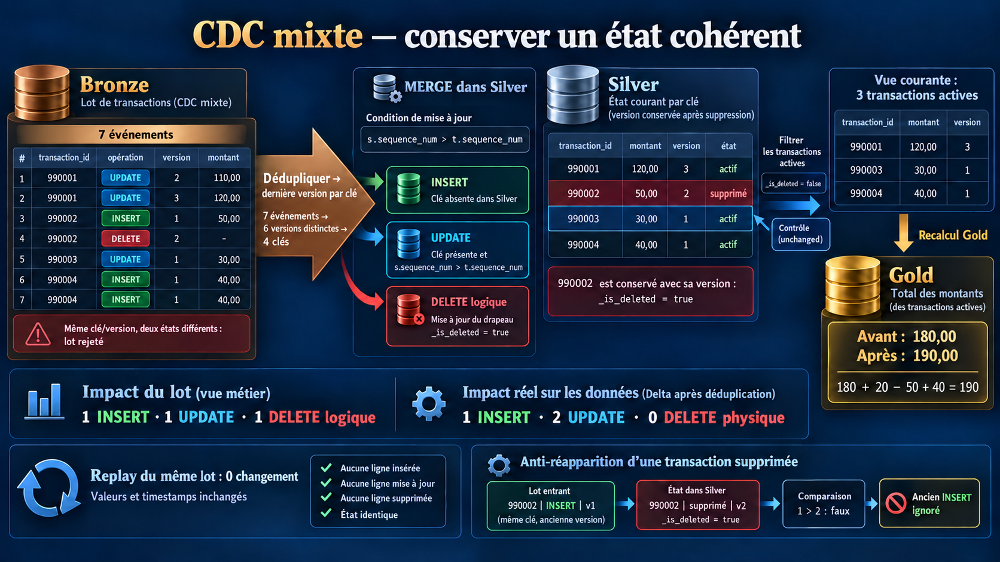
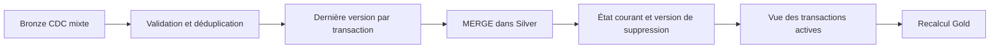

# Scenario 014 — INSERT + UPDATE + DELETE dans le même lot



## Objectif

Appliquer un lot CDC contenant des créations, des modifications et des suppressions de transactions. Le lot contient aussi un doublon et plusieurs versions pour une même clé.

Après le scénario 013, une question reste ouverte : si Silver supprime physiquement une transaction, comment empêcher un ancien INSERT de la recréer ?

Le scénario reproduit cette réapparition, puis conserve la version de suppression dans une table d'état. La vue courante et Gold ne comptent que les transactions actives.

## Architecture



| Couche | Objet |
|---|---|
| Bronze CDC | `dbx_lab_dev.bronze.scenario_014_transactions_cdc` |
| État Silver | `dbx_lab_dev.silver.scenario_014_transactions_state` |
| Vue courante | `dbx_lab_dev.silver.scenario_014_transactions_current` |
| Gold | `dbx_lab_dev.gold.scenario_014_transactions_summary` |

Ces trois tables et cette vue sont réservées à l'exercice. L'exécution traite un lot contrôlé ; elle ne lance pas de requête Structured Streaming.

## Baseline Silver

| transaction_id | payment_id | amount | sequence_num | _is_deleted |
|---|---|---:|---:|---|
| 990001 | 1001 | 100,00 | 1 | false |
| 990002 | 1002 | 50,00 | 1 | false |
| 990003 | 1003 | 30,00 | 1 | false |

```text
Transactions actives : 3
Montant Gold        : 180,00
```

La transaction `990003` sert de témoin. Elle reçoit un UPDATE en version 1, identique à sa version courante : ni ses valeurs ni son timestamp ne doivent changer.

## Dataset CDC

| event_id | transaction_id | operation | sequence_num | amount |
|---|---|---|---:|---:|
| txn_001_update_v2 | 990001 | UPDATE | 2 | 110,00 |
| txn_001_update_v3 | 990001 | UPDATE | 3 | 120,00 |
| txn_002_delete_v2 | 990002 | DELETE | 2 | NULL |
| txn_002_insert_v1 | 990002 | INSERT | 1 | 50,00 |
| txn_004_insert_v1 | 990004 | INSERT | 1 | 40,00 |
| txn_004_insert_v1 | 990004 | INSERT | 1 | 40,00 |
| txn_003_same_v1 | 990003 | UPDATE | 1 | 30,00 |

Les INSERT et UPDATE portent une image complète : `payment_id` et `amount` sont obligatoires. Un DELETE porte la clé et la version ; son montant peut être absent.

`sequence_num` représente l'ordre des changements fourni par la source, par transaction. L'ordre des lignes dans le lot ne définit pas cet ordre métier.

## Préparation du lot

Les événements sont contrôlés avant le MERGE : clé, version positive, opération reconnue et contenu requis. Deux contenus différents pour une même clé/version provoquent un rejet. Un même `event_id` associé à deux contenus différents est également rejeté.

```text
7 événements reçus
6 versions distinctes après déduplication
4 clés après sélection de la dernière version
```

`dropDuplicates` retire le second INSERT identique de `990004`. Une fenêtre par `transaction_id`, ordonnée par version décroissante, garde ensuite un seul événement par clé :

```text
990001 → UPDATE v3, montant 120,00
990002 → DELETE v2
990003 → UPDATE v1, même version que Silver
990004 → INSERT v1, montant 40,00
```

Cette sélection convient à des images complètes et à un état courant. Elle ne permet pas de reconstruire chaque état intermédiaire ni d'appliquer des mises à jour partielles cumulatives.

## Incident reproduit

Le premier MERGE utilise une suppression physique et applique les images reçues sans comparer leur version à Silver.

Le lot normalisé donne d'abord un résultat apparemment correct : trois transactions actives, pour `190,00`. La transaction `990002` a disparu.

L'ancien INSERT de `990002`, version 1, est ensuite présenté seul :

```text
Clé absente dans Silver → INSERT
Transactions actives    : 4
Montant Gold            : 240,00
```

Le DELETE v2 a retiré la ligne et sa version. Le MERGE ne dispose plus d'une cible à laquelle comparer l'INSERT v1. La transaction supprimée réapparaît et ajoute `50,00` à Gold.

## Correction

La baseline est restaurée avant de mesurer la correction.

Le MERGE rapproche les lignes sur `transaction_id`. Pour une clé présente, il ne modifie l'état que si la version source est strictement supérieure :

```python
.whenMatchedUpdate(
    condition="s.sequence_num > t.sequence_num",
    set={
        "payment_id": "CASE WHEN s.operation = 'DELETE' THEN t.payment_id ELSE s.payment_id END",
        "amount": "CASE WHEN s.operation = 'DELETE' THEN t.amount ELSE s.amount END",
        "sequence_num": "s.sequence_num",
        "_is_deleted": "s.operation = 'DELETE'",
        "_applied_at": "current_timestamp()",
    },
)
```

Le DELETE conserve la ligne, son ancien contenu et la version 2, avec `_is_deleted = true`. Cette ligne sert de marqueur de suppression, ou *tombstone*. La table stocke un état par clé, pas l'historique complet de ses versions.

La vue courante filtre `_is_deleted = false`. Gold est recalculée depuis cette vue.

Pour une clé absente, une image INSERT ou UPDATE est insérée. Un DELETE sans cible crée un marqueur de suppression. Une image plus récente peut réactiver une clé supprimée. Ces deux derniers cas sont prévus par le code mais ne sont pas exercés dans ce run.

## Premier passage

Exécution validée sur Databricks serverless le 7 octobre 2026.

| transaction_id | amount | sequence_num | _is_deleted | Résultat |
|---|---:|---:|---|---|
| 990001 | 120,00 | 3 | false | mise à jour |
| 990002 | 50,00 | 2 | true | suppression logique |
| 990003 | 30,00 | 1 | false | témoin inchangé |
| 990004 | 40,00 | 1 | false | insertion |

Les compteurs métier et Delta décrivent deux choses différentes :

| Mesure | INSERT | UPDATE | DELETE |
|---|---:|---:|---:|
| Changements métier | 1 | 1 | 1 logique |
| Lignes modifiées dans Delta | 1 | 2 | 0 physique |

Le DELETE logique met à jour une ligne Delta : il compte donc parmi les deux UPDATE. Les changements métier sont calculés en comparant les états avant et après le MERGE.

```text
État Silver : 4 clés, dont 1 supprimée logiquement
Vue courante : 3 transactions actives
Gold : 180 + 20 - 50 + 40 = 190,00
Durée du MERGE : 5,891 s
```

Le nombre de transactions actives reste à trois, malgré trois changements métier. Un simple contrôle du nombre de lignes ne suffit pas à vérifier le résultat.

## Replay et ancien INSERT

Le même lot est rejoué, puis l'ancien INSERT de `990002` est présenté seul, sans remise à zéro entre les passages.

| Contrôle | Premier passage corrigé | Replay du lot | Ancien INSERT v1 |
|---|---:|---:|---:|
| Lignes insérées Delta | 1 | 0 | 0 |
| Lignes mises à jour Delta | 2 | 0 | 0 |
| Lignes supprimées physiquement | 0 | 0 | 0 |
| Transactions actives | 3 | 3 | 3 |
| Montant Gold | 190,00 | 190,00 | 190,00 |
| Durée du MERGE | 5,891 s | 4,964 s | 5,234 s |

Au replay, chaque version source est inférieure ou égale à celle stockée. Aucune ligne ne change, y compris `_applied_at`.

L'ancien INSERT trouve toujours le marqueur de suppression de `990002` : `1 > 2` est faux. La transaction reste exclue de la vue courante et de Gold.

Les snapshots Silver complets et les agrégats Gold sont comparés après ces deux passages. Le témoin `990003` conserve aussi son état initial.

## Rejet d'un lot ambigu

Deux événements de `990001` sont présentés avec la même version 3, mais des montants différents : `120,00` et `121,00`.

```text
AMBIGUOUS_KEY_VERSION
Version Delta de Silver inchangée
État Silver et Gold inchangés
```

Le rejet intervient pendant la normalisation, avant toute écriture. Choisir arbitrairement l'une des deux lignes aurait masqué un problème de source.

Ce test couvre un conflit à l'intérieur d'un lot. Un contenu différent reçu dans un autre lot avec une version déjà appliquée est ignoré par la garde de version ; sa détection demanderait un contrôle supplémentaire.

## Point à retenir

- Dédupliquer les événements et sélectionner la dernière version par clé précèdent le MERGE.
- La version gagnante dans le lot doit encore être comparée à la version présente dans Silver.
- Conserver la version d'un DELETE empêche un ancien INSERT de recréer la clé.
- Un DELETE logique est un UPDATE pour les métriques Delta.
- Les clés, les valeurs, les versions, les timestamps et Gold donnent une preuve plus complète que le nombre de lignes.

Le MERGE écrit le contenu, la version et le drapeau de suppression dans une seule table Delta. Gold est écrite séparément : le run ne simule pas un échec entre ces étapes.

Les durées mesurent l'appel MERGE sur quatre clés au maximum, hors préparation, snapshots et recalcul Gold. Ce jeu ne constitue pas un benchmark. Le run ne teste pas de checkpoint, de reprise Structured Streaming ni de purge des marqueurs de suppression.

## Exécution

Depuis la racine du dépôt, avec le profil DEV connecté à `ad.khaffaji@gmail.com`. Le lanceur vérifie le compte avant d'importer le notebook :

```powershell
.\scenarios\scenario_014_insert_update_delete_dans_le_meme_lot\generate_mixed_cdc_batch.ps1 -Profile DEV
```

Chaque exécution prépare de nouveau les tables de l'exercice. La baseline est restaurée après reproduction de l'incident ; aucun reset n'intervient entre le MERGE corrigé, son replay et le test de l'ancien INSERT.

## Fichiers

- [apply_mixed_cdc.py](./apply_mixed_cdc.py) : préparation du lot, reproduction, correction, recalcul Gold et assertions.
- [generate_mixed_cdc_batch.ps1](./generate_mixed_cdc_batch.ps1) : exécution Databricks et récupération des résultats.
- [validate_mixed_cdc.sql](./validate_mixed_cdc.sql) : contrôles de la source, de l'état Silver, de la vue courante, de Gold et des métriques Delta.
- [execution_mixed.json](./execution_mixed.json) : résultats mesurés, snapshots et empreinte du code exécuté.
- [Run Databricks](https://8259550801519022.2.gcp.databricks.com/?o=8259550801519022#job/244718600553768/run/591183080431523) : exécution utilisée pour les résultats ci-dessus.
- [MERGE Delta](https://docs.databricks.com/gcp/en/delta/merge) : comportement des clauses et conditions.
