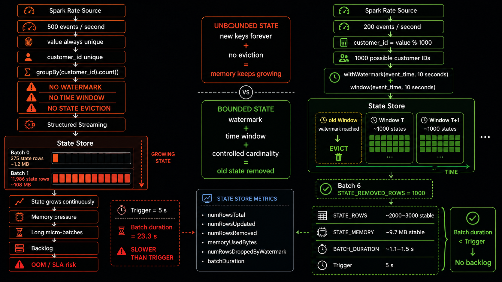
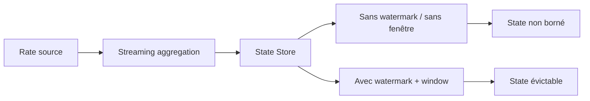

# Scenario 025 — État qui augmente sans borne



## Objectif

Comprendre comment une opération stateful en Structured Streaming peut faire grossir le State Store sans limite, puis montrer comment le borner avec une fenêtre temporelle et un watermark.

## Architecture



## Test non borné

Source synthétique :

```text
500 événements / seconde
customer_id = CAST(value AS STRING)
```

Chaque `value` étant unique, chaque événement crée un nouveau `customer_id`.

Agrégation :

```python
events.groupBy("customer_id").count()
```

Aucun watermark ni aucune fenêtre temporelle n'est utilisé.

### Résultats

```text
Batch 0
STATE_ROWS=275
STATE_MEMORY_BYTES=1 256 354
BATCH_DURATION_MS=23 318

Batch 1
STATE_ROWS=11 986
STATE_MEMORY_BYTES=108 565 862
BATCH_DURATION_MS=12 272
```

Le State Store passe donc très rapidement d'environ 1,2 MB à plus de 108 MB.

## Cause

```text
forte cardinalité
+
nouvelles clés permanentes
+
aucune règle d'éviction
=
State Store non borné
```

Le premier batch a également pris environ 23 secondes alors que le trigger était de 5 secondes, ce qui crée un risque de backlog.

## Test borné

La correction utilise :

```python
.withWatermark("event_time", "10 seconds")
.groupBy(
    window("event_time", "10 seconds"),
    "customer_id"
)
```

La cardinalité est également bornée :

```python
customer_id = value % 1000
```

## Résultats bornés

```text
Batch 0  STATE_ROWS=112   STATE_MEMORY_BYTES=7 869 777
Batch 1  STATE_ROWS=751   STATE_MEMORY_BYTES=9 179 912
Batch 2  STATE_ROWS=1000  STATE_MEMORY_BYTES=9 704 376
Batch 3  STATE_ROWS=2000  STATE_MEMORY_BYTES=9 704 376
Batch 4  STATE_ROWS=2000  STATE_MEMORY_BYTES=9 704 376
Batch 5  STATE_ROWS=3000  STATE_MEMORY_BYTES=9 704 376
Batch 6  STATE_ROWS=2000  STATE_REMOVED_ROWS=1000
Batch 7  STATE_ROWS=3000  STATE_MEMORY_BYTES=9 704 376
```

Le Batch 6 est la preuve clé :

```text
STATE_REMOVED_ROWS=1000
```

Spark a supprimé 1000 états devenus trop anciens.

## Comparaison

| Métrique | Non borné | Borné |
|---|---:|---:|
| State rows | 275 → 11 986 et continue | ~2 000–3 000 |
| State memory | ~1,2 MB → ~108 MB | ~9,7 MB stable |
| Batch duration | jusqu'à ~23 s | ~1,1–1,5 s |
| Trigger | 5 s | 5 s |
| Éviction | aucune | 1000 états supprimés observés |
| Risque backlog | élevé | faible sur ce test |

## Métriques importantes

- `INPUT_ROWS` : événements traités dans le micro-batch.
- `STATE_ROWS` : états actuellement conservés par Spark.
- `STATE_UPDATED_ROWS` : états créés ou modifiés pendant le batch.
- `STATE_REMOVED_ROWS` : états supprimés du State Store.
- `STATE_MEMORY_BYTES` : mémoire consommée par le State Store.
- `ROWS_DROPPED_BY_WATERMARK` : événements trop tardifs rejetés.
- `BATCH_DURATION_MS` : durée du micro-batch.

## Point Tech Lead

Pour toute opération stateful, il faut surveiller :

- croissance du state ;
- mémoire ;
- évictions ;
- durée des micro-batches ;
- input rate vs processing rate ;
- late data ;
- backlog.

Une opération stateful sans mécanisme d'éviction peut provoquer :

```text
mémoire élevée
→ micro-batches plus longs
→ backlog
→ SLA dépassé
→ OOM / échec du stream
```

## Fichiers

- `state_store_unbounded.py` : reproduit le State Store non borné.
- `state_store_bounded.py` : applique watermark + window et observe l'éviction.
- `scenario_025_results.txt` : conserve les métriques mesurées.
- `image_prompt_scenario_025.txt` : prompt pour le diagramme d'architecture.
