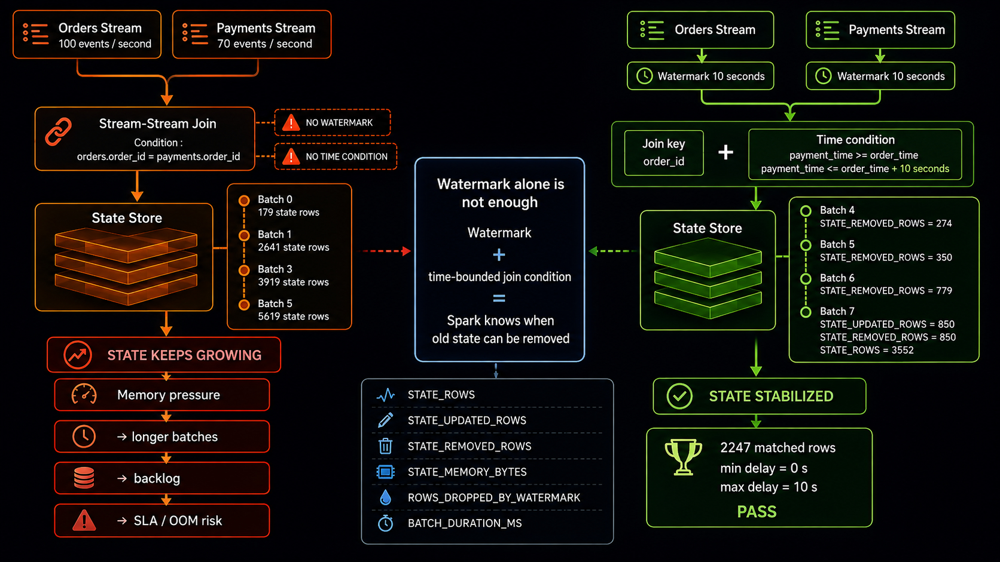

# Scenario 026 — Jointure stream-stream sans contrainte temporelle



## Objectif

Montrer pourquoi une jointure entre deux streams peut faire grossir le State Store sans limite lorsqu'elle est définie uniquement sur une clé métier, puis montrer comment la borner avec des watermarks et une condition temporelle.

## Test non borné

Deux streams synthétiques sont générés avec Spark `rate` :

```text
orders   : 100 événements / seconde
payments : 70 événements / seconde
```

La jointure utilise uniquement :

```python
o.order_id == p.order_id
```

Sans watermark ni condition temporelle, Spark doit conserver les lignes des deux côtés car un match peut théoriquement arriver plus tard.

### Résultats

```text
Batch 0  STATE_ROWS=179
Batch 1  STATE_ROWS=2641
Batch 2  STATE_ROWS=3170
Batch 3  STATE_ROWS=3919
Batch 4  STATE_ROWS=4769
Batch 5  STATE_ROWS=5619
```

Le state augmente à chaque batch.

## Test borné

La correction ajoute des watermarks sur `order_time` et `payment_time`, ainsi qu'une condition temporelle :

```text
payment_time >= order_time
payment_time <= order_time + 10 seconds
```

### Résultats

```text
Batch 0  STATE_ROWS=126   STATE_REMOVED_ROWS=0
Batch 1  STATE_ROWS=1098  STATE_REMOVED_ROWS=0
Batch 2  STATE_ROWS=1555  STATE_REMOVED_ROWS=0
Batch 3  STATE_ROWS=2405  STATE_REMOVED_ROWS=0
Batch 4  STATE_ROWS=2981  STATE_REMOVED_ROWS=274
Batch 5  STATE_ROWS=3481  STATE_REMOVED_ROWS=350
Batch 6  STATE_ROWS=3552  STATE_REMOVED_ROWS=779
Batch 7  STATE_ROWS=3552  STATE_REMOVED_ROWS=850
```

Au Batch 7 :

```text
STATE_UPDATED_ROWS=850
STATE_REMOVED_ROWS=850
STATE_ROWS=3552
```

Le state est stabilisé : de nouvelles lignes entrent pendant que d'anciennes sont évacuées.

## Validation métier

```text
matched_rows=2247
min_delay_seconds=0
max_delay_seconds=10
scenario_026_result=PASS
```

Les matches respectent donc la borne définie.

## Comparaison

| Métrique | Sans borne | Avec borne |
|---|---:|---:|
| State rows | 179 → 5619 et continue | stabilisation autour de 3552 |
| Éviction | aucune | jusqu'à 850 états supprimés / batch |
| Watermarks | non | oui |
| Condition temporelle | non | 0 à 10 secondes |
| Validation finale | — | PASS |

## Conclusion

Dans une jointure stream-stream, les watermarks seuls ne suffisent pas.

Il faut également une condition temporelle de jointure pour que Spark sache quand une ligne ne pourra plus matcher à l'avenir.

```text
watermark orders
+
watermark payments
+
join key
+
time range
=
state évictable
```

## Risques

Une jointure stream-stream non bornée peut provoquer :

```text
State Store croissant
→ mémoire plus élevée
→ micro-batches plus longs
→ backlog
→ dépassement de SLA
→ risque d'OOM
```

## Fichiers

- `stream_join_unbounded.py`
- `stream_join_bounded.py`
- `scenario_026_results.txt`
- `image_prompt_scenario_026.txt`
