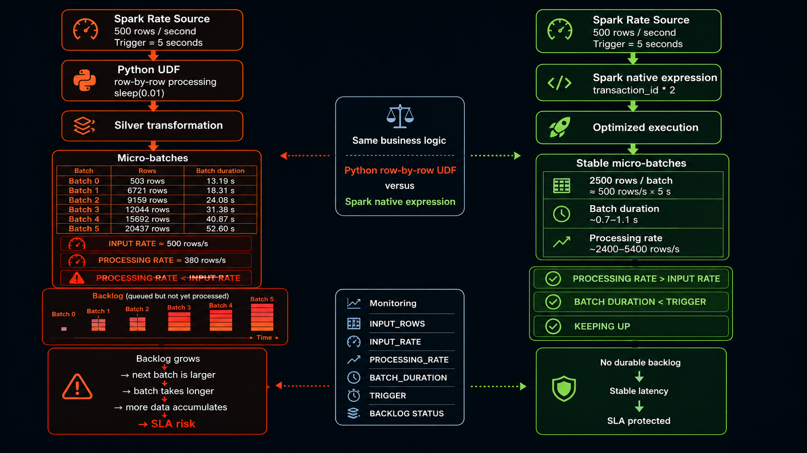

# Scenario 028 — Transformation trop lente



## Objectif

Reproduire un stream qui reçoit les données plus vite qu'il ne peut les traiter, puis supprimer la transformation coûteuse et comparer le débit et la durée des micro-batches.

## Baseline

Source : `500 rows/s`, trigger `5 s`.

Transformation volontairement lente :

```python
@F.udf(returnType=LongType())
def slow_transform(value):
    time.sleep(0.01)
    return value * 2
```

### Résultats

```text
Batch 0 : 503 rows   | 13.19 s | processing 38 rows/s
Batch 1 : 6721 rows  | 18.31 s | processing 367 rows/s
Batch 2 : 9159 rows  | 24.08 s | processing 380 rows/s
Batch 3 : 12044 rows | 31.38 s | processing 384 rows/s
Batch 4 : 15692 rows | 40.87 s | processing 384 rows/s
Batch 5 : 20437 rows | 52.60 s | processing 389 rows/s
```

La source produit environ `500 rows/s` alors que le traitement reste autour de `380 rows/s`.

```text
processing rate < input rate
→ backlog
→ batch suivant plus gros
→ batch plus long
→ encore plus de données accumulées
```

## Correction

La logique métier reste identique :

```text
processed_value = transaction_id * 2
```

La Python UDF est remplacée par une expression Spark native :

```python
F.col("transaction_id") * 2
```

## Résultats après correction

```text
Batch 1 : 6009 rows | 1.11 s | processing 5389 rows/s
Batch 2 : 1955 rows | 0.80 s | processing 2438 rows/s
Batch 3 : 2500 rows | 0.76 s | processing 3294 rows/s
Batch 4 : 2500 rows | 0.83 s | processing 3008 rows/s
Batch 5 : 2500 rows | 0.73 s | processing 3406 rows/s
Batch 6 : 2500 rows | 0.73 s | processing 3397 rows/s
```

En régime stable :

```text
500 rows/s × 5 s = 2500 rows par micro-batch
```

## Comparaison

| Métrique | Avant | Après |
|---|---:|---:|
| Input rate | ~500 rows/s | ~500 rows/s |
| Processing rate | ~380 rows/s | ~3000–5400 rows/s |
| Batch duration | 13 → 53 s | ~0.7–1.1 s |
| Trigger | 5 s | 5 s |
| Backlog | croissant | aucun backlog durable |
| Statut | FALLING_BEHIND | KEEPING_UP |

## Interprétation

- `INPUT_ROWS` : lignes prises dans le micro-batch.
- `INPUT_RATE_ROWS_SEC` : rythme d'arrivée depuis la source.
- `PROCESSING_RATE_ROWS_SEC` : vitesse réelle de traitement.
- `BATCH_DURATION_SEC` : durée totale du micro-batch.
- `TRIGGER_SEC` : cadence demandée.
- `FALLING_BEHIND` : le batch dépasse le trigger.
- `KEEPING_UP` : le batch termine avant le prochain déclenchement.

## Conclusion

Le signal critique est `processing rate < input rate`.

L'amélioration efficace ici consiste à supprimer le coût de la Python UDF ligne par ligne et à utiliser une expression Spark native.

## Fichiers

- `slow_microbatch.py`
- `optimized_microbatch.py`
- `scenario_028_results.txt`
- `scenario_028_checks.sql`
- `image_prompt_scenario_028.txt`
